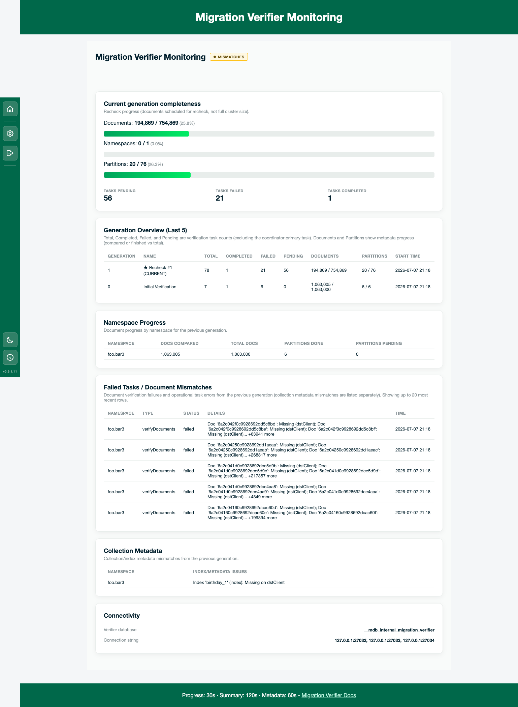
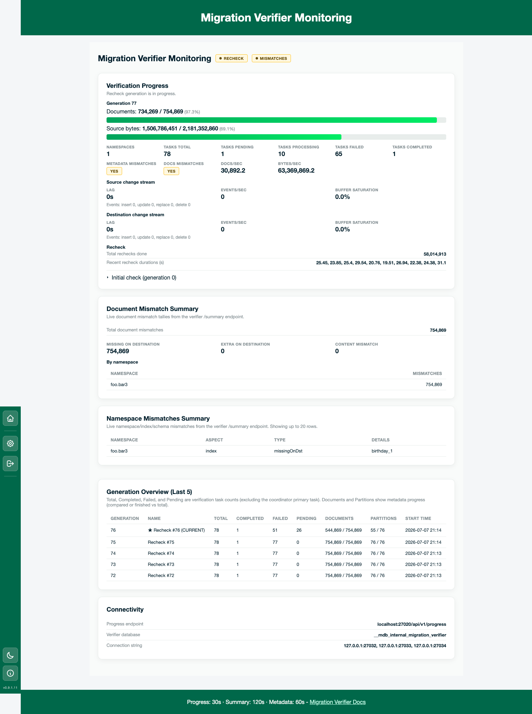

# Migration Monitoring

Migration Monitoring is the real-time dashboard for ongoing **mongosync** cluster-to-cluster migrations. Open it from the hub (**Migration monitoring** → **Open migration monitoring**) or go directly to `/live/`.


## What it shows

The dashboard polls mongosync and/or the destination metadata database and renders cards for:

- **Migration state** — coordinator state badge (e.g. `RUNNING`, `PAUSED`, `COMMITTED`)
- **Migration progress** — copy phase, bytes/collections/partitions, lag time, phase start times
- **Index building** — indexes rebuilt on the destination after the initial copy
- **Embedded Verifier** — mongosync's built-in verifier (when enabled)
- **Filtered migration** — namespace include/exclude filters and natural-order copy settings (from metadata)

Refresh interval defaults to **10 seconds** (`MI_REFRESH_TIME`). The browser polls Mongosync Insights only; MI's backend fetches mongosync's progress API and/or the destination metadata database. Sidebar **Settings** overrides the interval for this browser only.


## Configuration inputs

You can provide **one or both** of the following on the Migration monitoring home form (or via environment variables). The endpoint is the primary live source and the connection string is an optional complement.

| Input | Purpose | Env variable |
|-------|---------|--------------|
| **Mongosync progress endpoint** | Poll mongosync's HTTP progress API (`/api/v1/progress`) | `MI_PROGRESS_ENDPOINT_URL` |
| **MongoDB connection string** | Read mongosync internal metadata on the destination cluster (`resumeData`, `globalState`, `indexCorrection`, verifier persistence DBs) | `MI_CONNECTION_STRING` |


At least one must be configured to start a session.

The mongosync internal metadata database name is **auto-detected** on the destination cluster: `__mdb_internal_mongosync` (new) when present, otherwise `mongosync_reserved_for_internal_use` (legacy). This is not configurable.

### Progress endpoint (UI)

When not set via `MI_PROGRESS_ENDPOINT_URL`, the form asks for:

- **Host** — hostname or IP (e.g. `localhost`). Leave **empty** to skip the progress endpoint and use metadata-only monitoring.
- **Port** — defaults to **27182** (mongosync's default API port).

The path `/api/v1/progress` is fixed and appended automatically; do not enter it in the UI.

### Progress endpoint (environment)

`MI_PROGRESS_ENDPOINT_URL` accepts either form:

```bash
export MI_PROGRESS_ENDPOINT_URL="localhost:27182"
# or
export MI_PROGRESS_ENDPOINT_URL="localhost:27182/api/v1/progress"
```

A leading `http://` or `https://` prefix is stripped on load.

## Data source priority

When **both** the progress endpoint and connection string are configured:

1. **Progress endpoint** is the primary source for in-memory progress (copy stats, index building tracker, embedded verifier snapshot from mongosync).
2. **Metadata database** fills gaps when the progress endpoint is unavailable, or when the endpoint does not expose index-building or verification data.

If the progress endpoint fails to respond, the dashboard still loads metadata when a connection string is available, and shows a progress-endpoint warning.

## Index building (metadata fallback)

When the progress endpoint is not used or does not report index-building data, MI reads **`indexCorrection`** counters from the internal metadata database.

If counters lag behind reality (indexes already exist on the destination but counters are pending), MI optionally verifies pending indexes by **index name** on the destination cluster. That fallback is **approximate** — the Index building card shows:

> *Progress from metadata (approximate).*

Control how often destination `list_indexes` scans run with:

```bash
export MI_INDEX_BUILD_REFRESH_TIME=60   # seconds; default 60
```

The counter aggregate still runs on every poll; only the destination verification scan is throttled.

Index-building progress is suppressed when `buildIndexes` is `never`, or before the copy phase reaches the appropriate stage (CEA gating).

## Embedded Verifier vs migration-verifier tool

Migration Monitoring includes two separate verifier workflows:

| Feature | Where | Data source |
|---------|-------|-------------|
| **Embedded Verifier** card | Migration Monitoring dashboard | Progress endpoint and/or mongosync verifier persistence on the destination (`MI_EMBEDDED_VERIFIER_SRC_DB_NAME` / `MI_EMBEDDED_VERIFIER_DST_DB_NAME`, default `__mdb_internal_mongosync_verifier_src` / `_dst`). Requires mongosync **verifier persistence** (`enableVerifierPersistence`). |
| **Migration Verifier** form | Same `/live/` page, second card | External [migration-verifier](https://github.com/mongodb-labs/migration-verifier) tool HTTP `/api/v1/progress` endpoint (`MI_VERIFIER_PROGRESS_ENDPOINT_URL`) and/or metadata database (`MI_VERIFIER_CONNECTION_STRING`, `MI_MIGRATION_VERIFIER_DB_NAME`). |

When metadata is used for embedded verifier progress, the card notes that progress is **approximate**.

## Migration Verifier monitoring

The second form on `/live/` monitors the standalone migration-verifier tool (not mongosync embedded verifier). On the home page, the **progress endpoint** fields appear **before** the connection string on both forms; the endpoint is the primary live source and the connection string is an optional complement for metadata cards.

Provide **one or both** of:

| Input | Purpose | Env variable |
|-------|---------|--------------|
| **Migration Verifier progress endpoint** | Poll migration-verifier's HTTP progress API (`/api/v1/progress`) for live phase, generation stats, change-stream lag, and task counts | `MI_VERIFIER_PROGRESS_ENDPOINT_URL` |
| **MongoDB connection string** | Read verifier metadata for generation history, namespace progress, and mismatches | `MI_VERIFIER_CONNECTION_STRING` (falls back to `MI_CONNECTION_STRING`) |

At least one must be configured to start a session.

### Progress endpoint (UI)

When not set via `MI_VERIFIER_PROGRESS_ENDPOINT_URL`, the form asks for:

- **Host** — hostname or IP (e.g. `localhost`). Leave **empty** to skip the progress endpoint and use metadata-only monitoring.
- **Port** — defaults to **27020** (migration-verifier's default API port).

The path `/api/v1/progress` is fixed and appended automatically; do not enter it in the UI.

### Progress endpoint (environment)

```bash
export MI_VERIFIER_PROGRESS_ENDPOINT_URL="localhost:27020"
# or
export MI_VERIFIER_PROGRESS_ENDPOINT_URL="localhost:27020/api/v1/progress"
```

Metadata is read from `MI_MIGRATION_VERIFIER_DB_NAME` (default `__mdb_internal_migration_verifier`). For **migration-verifier** version compatibility, see [README.md — Migration Verifier compatibility](README.md#migration-verifier-compatibility) (tested with **0.2.2**).

### How the dashboard updates

The dashboard JavaScript only talks to Mongosync Insights. MI's backend fetches migration-verifier's HTTP APIs and the metadata database on your behalf.

The page refreshes three areas on different schedules. The footer shows the current intervals (`Progress: Xs · Summary: Ys · Metadata: Zs`). Use the sidebar **Settings** control to change the base refresh rate — all three intervals scale together. Settings stores the refresh interval in your **browser session** (`sessionStorage`). It does not change server environment variables; reload defaults to `MI_REFRESH_TIME` unless you change Settings again.

| Area | Default interval | You need | What it updates |
|------|------------------|----------|-----------------|
| **Progress** | 30s (`MI_REFRESH_TIME × 3`) | Progress endpoint | **Verification Progress** card and the toolbar status badge |
| **Summary** | 120s (`× 12`) | Progress endpoint | **Document Mismatch Summary** and **Namespace Mismatches Summary** |
| **Metadata** | 60s (`× 6`) | Connection string | **Generation overview** and related history cards |

If you did not configure a source, that area is not polled (for example, no connection string → no metadata cards).

### With a progress endpoint (recommended)

When migration-verifier’s HTTP API is configured, the dashboard focuses on live data:

1. **Verification Progress** — current phase, generation, document/byte progress, task counts, throughput, and change-stream lag.
2. **Document Mismatch Summary** / **Namespace Mismatches Summary** — live mismatch tallies from the verifier (updated less often than progress).
3. **Generation overview** (if a connection string is also set) — history table for past generations.

The toolbar badge shows overall status:

| Badge | Meaning |
|-------|---------|
| **In Progress** (blue) | Initial verification (generation 0) is still running |
| **Pass** (green) | Recheck finished with no mismatches |
| **Mismatches** (yellow) | Recheck finished but mismatches were found |

When both the endpoint and connection string are set, the live **Verification Progress** and **Summary** cards are primary; some metadata-only cards are hidden because the live cards already cover that information.


### Metadata only (no progress endpoint)

If you only provide a connection string, MI reads the verifier metadata database instead. You get a fuller set of history cards (completeness summary, generation overview, namespace progress, failed tasks, collection metadata mismatches). The toolbar badge is derived from the last completed generation in metadata.



### Errors and partial data

- If the **progress endpoint** is unreachable but a connection string is set, metadata cards still update and a warning is shown for the endpoint.
- If a **metadata query** fails, only that card shows a warning; other cards keep updating.
- If migration-verifier’s metadata version does not match what MI expects (currently version **7**), a **Warnings** card appears — upgrade MI or migration-verifier to compatible versions.

### Tuning (optional)

| Variable | What it changes |
|----------|-----------------|
| `MI_REFRESH_TIME` | Base refresh rate (sidebar Settings) |
| `MI_VERIFIER_SUMMARY_MIN_DURATION_SECS` | Ignore very short-lived mismatches in summary counts (`0` = show all) |
| `MI_VERIFIER_GENERATION_LIMIT` | How many generations appear in the overview table (default 5) |

HTTP timeouts and other advanced settings: see **[CONFIGURATION.md](CONFIGURATION.md)**.



## Related documentation

- **[CONFIGURATION.md](CONFIGURATION.md)** — environment variables (`MI_REFRESH_TIME`, `MI_PROGRESS_ENDPOINT_URL`, `MI_INDEX_BUILD_REFRESH_TIME`, etc.)
- **[LOG_ANALYZER.md](LOG_ANALYZER.md)** — offline log analysis
- **[CONNECTION_STRING.md](CONNECTION_STRING.md)** — connection string formats and security
- **[PACKAGING.md](PACKAGING.md)** — pre-configuring env vars in packaged installs

### License

[Apache 2.0](http://www.apache.org/licenses/LICENSE-2.0)

DISCLAIMER
----------
Please note: all tools/ scripts in this repo are released for use "AS IS" **without any warranties of any kind**,
including, but not limited to their installation, use, or performance.  We disclaim any and all warranties, either 
express or implied, including but not limited to any warranty of noninfringement, merchantability, and/ or fitness 
for a particular purpose.  We do not warrant that the technology will meet your requirements, that the operation 
thereof will be uninterrupted or error-free, or that any errors will be corrected.

Any use of these scripts and tools is **at your own risk**.  There is no guarantee that they have been through 
thorough testing in a comparable environment and we are not responsible for any damage or data loss incurred with 
their use.

You are responsible for reviewing and testing any scripts you run *thoroughly* before use in any non-testing 
environment.

Thanks,  
The MongoDB Support Team